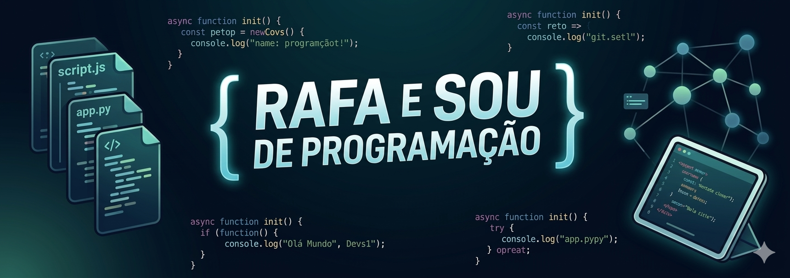

  
  
    

  <h1> Olá, eu sou o Rafael</h1>
  
  

    <b>Full-Stack Developer | Software Architect Enthusiast</b> 
    <i>"Transformando lógica complexa em experiências digitais memoráveis."</i>
  

  

    
    
  

---

  <h3>📑 Sobre Mim</h3>
  
  

  

    📍 Baseado em <b>Portugal</b>, focado em arquiteturas escaláveis e código de alta performance. 
    Atualmente a elevar o padrão de gestão urbana com o projeto <b>Cidadão+</b>. 
    A minha filosofia foca-se em <b>Clean Architecture</b> e na entrega de valor real ao utilizador final.
  

  

    🚀 <b>Especialidade:</b> PHP Moderno • Ecossistema React • Engenharia de Dados
  

---

### 🛠️ Tech Stack & Skills

  <table border="0">
    <tr>
      <td align="center"><b>Frontend</b></td>
      <td align="center"><b>Backend</b></td>
      <td align="center"><b>Tools</b></td>
    </tr>
    <tr>
      <td>
         
         
        
      </td>
      <td>
         
         
        
      </td>
      <td>
         
         
        
      </td>
    </tr>
  </table>
  
   
  

---

### 🚀 Estrela do Portfólio

  <table border="0" width="100%">
    <tr>
      <td width="60%" valign="top" align="left">
        <h4>🌍 Cidadão+ — Gestão Urbana Inteligente</h4>
        
Uma solução <i>Smart City</i> disruptiva para a ponte entre cidadãos e autarquias.

        

          <b>Core Features:</b> 
          🛡️ Autenticação Militar (2FA) 
          📊 Dashboard Analytics em Tempo Real 
          📍 Georreferenciação de Ocorrências
        

        
      </td>
      <td width="40%" align="center">
        
      </td>
    </tr>
  </table>

---

### 🎵 Listening Now

  

---

### 🌐 Vamos Construir Algo Incrível?

  
  

 

  

