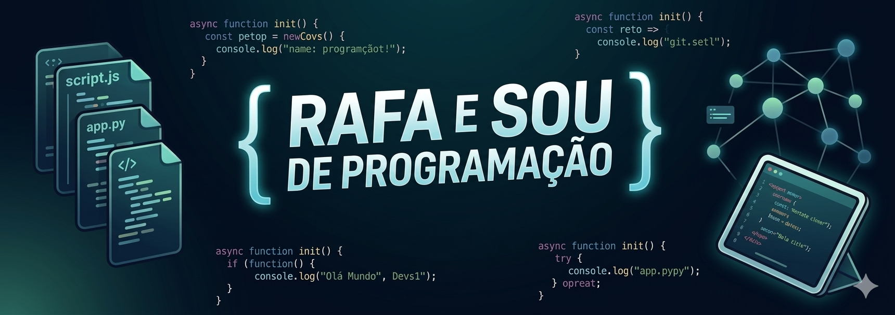

  <!-- Banner Superior -->
  

    

  <h1>👋 Olá, eu sou o Rafael</h1>

  

    <b>👨‍💻 Web Developer</b> | <i>Transformando ideias em experiências digitais modernas e funcionais.</i>
  

  <!-- Badges de Estatísticas Rápida -->
  

    
    
  

---

## 📑 Sobre Mim

  

 

* 📍 **Localização:** Portugal
* 💻 **Foco Profissional:** Desenvolvimento Web Frontend & Backend
* 🚀 **Objetivo Atual:** Criar aplicações web responsivas, eficientes e focar no ecossistema **React & TypeScript**.
* 💡 **Filosofia:** Converter problemas complexos em interfaces simples, intuitivas e centradas no utilizador.

---

## 🛠️ Tech Stack & Ferramentas

### Frontend

### Backend & Base de Dados

### Ferramentas & Workflow

 

<!-- Ícones Dinâmicos de Tecnologias -->

---

## 📊 Estatísticas do GitHub

  
  

---

## 🚀 Projetos em Destaque

<table>
  <tr>
    <td width="50%" valign="top">
      <h3 align="center">🌍 Cidadão+ — Gestão Urbana</h3>
      

        
      

      
Ponte digital entre cidadãos e a administração local para registo, acompanhamento e resolução de ocorrências na via pública.

      
<b>✨ Destaques:</b>

      <ul>
        <li>Autenticação e gestão de utilizadores</li>
        <li>Painel administrativo interactivo</li>
        <li>Geolocalização de ocorrências</li>
        <li>Integração com base de dados</li>
      </ul>
       
      

        
      

    </td>
    <td width="50%" valign="top">
      <h3 align="center">💇‍♀️ Susete Cabeleireiro</h3>
      

        
      

      
Plataforma web para presença digital de um salon profissional, focada na apresentação de serviços e agendamentos online.

      
<b>✨ Destaques:</b>

      <ul>
        <li>Catálogo de serviços e preços</li>
        <li>Sistema de avaliações de clientes</li>
        <li>Área de cliente com agendamentos</li>
        <li>Painel de gestão em desenvolvimento</li>
      </ul>
       
      

        
      

    </td>
  </tr>
</table>

---

## 🎯 Foco Atual & Objetivos

* ⚛️ **Especialização Frontend:** Aprofundar conceitos avançados de React e TypeScript.
* 🎨 **UI/UX & Responsividade:** Construir interfaces cada vez mais fluidas e acessíveis.
* 💼 **Aberto a Oportunidades:** Disponível para projetos freelance, colaborações Open Source e oportunidades de trabalho em desenvolvimento web.

---

## 🌐 Conecta-te Comigo

  
  
  

 

  

